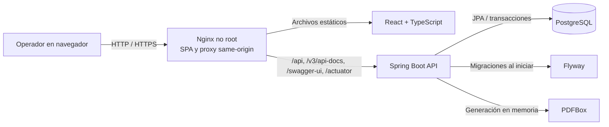

# PrintVerse

PrintVerse es una aplicación web para administrar cotizaciones y producción en un taller de impresión 3D. Resuelve un problema concreto: reunir costos técnicos, condiciones comerciales, clientes y seguimiento de fabricación en un mismo flujo, sin depender de hojas de cálculo desconectadas ni perder las condiciones históricas de una propuesta.

El backend conserva la autoridad sobre cálculos y transiciones de estado. La SPA permite operar el sistema, pero no decide importes finales ni reglas de negocio.

## Capacidades actuales

- Autenticación stateless con JWT y roles `ADMIN` y `OPERATOR`.
- Dashboard comercial y operativo con pipeline, ingresos aceptados, utilidad estimada, tasa de aceptación, órdenes próximas o vencidas, stock bajo y estado de impresoras.
- Gestión y detalle de clientes, con su historial de cotizaciones.
- Catálogo de materiales con precio, tipo, marca, color, inventario y umbral de stock bajo.
- Catálogo de impresoras con costo por hora y estado operativo; `BUSY` se gestiona automáticamente desde producción.
- Cotizaciones editables en borrador, cargos adicionales, descuento, impuestos, anticipo, fechas y precio manual opcional.
- Cálculo autoritativo de costo técnico, riesgo de falla, precio sugerido, utilidad y margen real.
- PDF descargable de la cotización.
- Conversión idempotente de una cotización aceptada en orden de producción.
- Seguimiento por pieza, asignación de impresora, avance, prioridad, fechas y entrega.
- API documentada con OpenAPI y Swagger UI.
- Esquema versionado mediante Flyway.
- Contenedores para PostgreSQL, backend y frontend Nginx con healthchecks.

## Flujo principal

1. Se registra el cliente y se preparan materiales e impresoras activas.
2. Se crea una cotización `DRAFT` con sus condiciones comerciales.
3. Se agregan piezas con peso, tiempo, material, impresora, riesgo y cargos adicionales.
4. El backend recalcula el desglose y la SPA presenta el resultado retornado por la API.
5. Se descarga el PDF y la cotización se marca explícitamente como `SENT`.
6. La respuesta del cliente se registra como `ACCEPTED` o `REJECTED`.
7. Una cotización `ACCEPTED` puede convertirse una sola vez en orden de producción.
8. La orden avanza por `PENDING -> IN_PRODUCTION -> READY -> DELIVERED`; también puede cancelarse antes de entregarse.
9. Para marcar una orden como `READY`, todas sus piezas deben estar completas.

Una impresora se ocupa únicamente cuando una pieza entra en `IN_PROGRESS`. Las asignaciones en cola (`PENDING` o `BLOCKED`) no reservan físicamente la máquina. Bloquear, completar o cancelar el trabajo activo libera la impresora; mantenimiento y fuera de servicio impiden nuevas asignaciones.

## Arquitectura



En Compose, solo Nginx publica un puerto. PostgreSQL y Spring Boot permanecen en la red interna. Durante desarrollo, Vite replica este modelo con un proxy hacia `localhost:8080`.

## Stack

| Área | Tecnología |
| --- | --- |
| Backend | Java 21, Spring Boot 3.5, Spring Web, Security, Data JPA, Validation y Actuator |
| Persistencia | PostgreSQL 17, Hibernate y Flyway |
| Documentos/API | PDFBox y springdoc OpenAPI |
| Frontend | React 19, TypeScript 5.7, Vite 6 y React Router 7 |
| Calidad | JUnit 5, Mockito, Vitest, Testing Library y ESLint |
| Entrega | Docker multietapa, Nginx no root, Docker Compose y GitHub Actions |

## Cálculos autoritativos

La API calcula con `BigDecimal` y redondeo `HALF_UP`. Los importes persistidos se redondean a dos decimales y los porcentajes de margen a cuatro.

Por unidad:

```text
materialCostUnit = (weightGrams / 1000) * materialPricePerKgSnapshot
machineCostUnit = (printTimeMinutes / 60) * printerCostPerHourSnapshot
technicalBaseCostUnit = materialCostUnit + machineCostUnit
failureRiskCostUnit = technicalBaseCostUnit * failureRiskPercentage / 100
additionalChargesUnit = sum(additionalCharges)
internalCostUnit = technicalBaseCostUnit + failureRiskCostUnit + additionalChargesUnit
suggestedPriceUnit = internalCostUnit * (1 + markupPercentage / 100)
finalUnitPrice = manualUnitPrice ?? suggestedPriceUnit
itemSubtotal = finalUnitPrice * quantity
```

Para toda la cotización:

```text
internalCost = sum(internalCostUnit * quantity)
finalSubtotal = sum(finalUnitPrice * quantity)
discountAmount = finalSubtotal * discountPercentage / 100
netSubtotal = finalSubtotal - discountAmount
taxAmount = taxEnabled ? netSubtotal * taxPercentage / 100 : 0
total = netSubtotal + taxAmount
estimatedProfit = netSubtotal - internalCost
realMarginPercentage = netSubtotal > 0 ? estimatedProfit / netSubtotal * 100 : 0
```

`markup` y margen no son equivalentes. Un markup de 40% sobre un costo de 100 produce un precio de 140 y un margen real de `40 / 140 = 28.57%`, antes de descuentos e impuestos. El markup es una entrada sobre costo; el margen es un resultado sobre venta neta.

### Snapshots históricos

Una pieza conserva el precio por kilogramo, costo por hora y nombres de material e impresora vigentes al cotizar. La cotización también conserva los datos comerciales del cliente al enviarse. Cambiar catálogos o datos del cliente no reescribe propuestas históricas. Mientras el documento siga en `DRAFT`, seleccionar explícitamente otro material o impresora captura nuevos valores.

## Seguridad

- `POST /api/auth/login` intercambia usuario y contraseña por un JWT HS256.
- La SPA guarda la sesión en `sessionStorage`, la envía como Bearer token y la elimina ante una respuesta `401`.
- Todos los endpoints de negocio requieren autenticación.
- El rol `ADMIN` es obligatorio para crear o modificar materiales e impresoras.
- Swagger UI, el documento OpenAPI y el healthcheck son públicos; los endpoints descritos mantienen sus propias reglas de autenticación.
- Actuator expone únicamente `health` y nunca incluye detalles internos.
- El perfil `prod` exige credenciales de base de datos, secreto JWT y contraseña del administrador inicial.
- Los contenedores de aplicación se ejecutan sin privilegios de root.

La configuración incluida no sustituye TLS. En Internet debe existir un proxy o balanceador con HTTPS, límites de solicitud, política de logs y gestión externa de secretos. El límite de login incluido en Nginx agrupa por conexión de origen; detrás de otro proxy, ese punto exterior debe aplicar el límite por cliente y ajustar el límite interior según su tráfico.

## Migraciones

Flyway ejecuta los scripts de `src/main/resources/db/migration` y Hibernate usa `ddl-auto=validate`; la aplicación no actualiza el esquema automáticamente mediante JPA.

Las migraciones actuales crean el núcleo de cotización, snapshots comerciales, producción, inventario/operación de activos y usuarios. `FLYWAY_BASELINE_ON_MIGRATE` está desactivado en producción. Solo debe activarse para adoptar una base sin historial de Flyway cuyo esquema se haya verificado como equivalente a `V1__initial_schema.sql`; primero debe hacerse un backup. No sirve para baselinar cualquier esquema no vacío y no es necesario en una instalación nueva.

## Estructura

```text
.
├── frontend/                    SPA, pruebas, Dockerfile y Nginx
│   └── src/
│       ├── api/                 Cliente HTTP tipado
│       ├── auth/ y context/     Sesión y contexto de autenticación
│       ├── components/          Componentes y layout
│       ├── pages/               Dashboard y flujos operativos
│       ├── types/               Contratos TypeScript
│       └── utils/               Formato y reglas de presentación
├── src/main/java/com/printverse
│   ├── config/                  Seguridad, CORS, bootstrap y OpenAPI
│   ├── controller/              API REST
│   ├── domain/                  Entidades y estados
│   ├── dto/                     Contratos de entrada y salida
│   ├── exception/               ProblemDetail y errores de negocio
│   ├── repository/              Acceso a datos
│   └── service/                 Casos de uso y cálculos
├── src/main/resources/db/       Migraciones Flyway
├── src/test/                    Pruebas backend
├── docker-compose.yml           Stack completo
└── .github/workflows/ci.yml     Verificación automática
```

## Quickstart con Compose

Requisitos: Docker Engine con Docker Compose y OpenSSL para generar el secreto.

1. Crea la configuración local:

```bash
cp .env.example .env
```

2. Genera un secreto JWT y completa las credenciales vacías de `.env`:

```bash
openssl rand -hex 32
```

La contraseña de base de datos y la del administrador deben ser distintas y fuertes. `.env` está ignorado por Git.

3. Construye e inicia el stack:

```bash
docker compose up -d --build
docker compose ps
```

4. Abre `http://localhost:8088` e inicia sesión con `APP_ADMIN_USERNAME` y `APP_ADMIN_PASSWORD`.

El puerto puede cambiarse con `FRONTEND_PORT`. No hay puertos públicos para PostgreSQL ni para la API. El volumen `printverse_postgres_data` conserva los datos entre recreaciones de contenedores.

Para detener los servicios sin borrar datos:

```bash
docker compose down
```

No uses `docker compose down -v` salvo que realmente quieras eliminar la base persistente.

### Bootstrap del administrador

En producción, `APP_ADMIN_PASSWORD` es obligatoria. Al iniciar, el backend normaliza `APP_ADMIN_USERNAME`, cifra la contraseña con BCrypt y crea el usuario `ADMIN` solo si no existe. Reiniciar con otra contraseña no rota la credencial de un usuario ya creado; actualmente esa operación requiere gestión directa controlada de datos.

## Desarrollo local

Requisitos: JDK 21, Maven 3.9+, Node.js 22, npm 10+ y PostgreSQL 17.

Puede iniciarse una base aislada de desarrollo con Docker:

```bash
docker run --name printverse-db-dev --rm \
  -e POSTGRES_DB=printverse \
  -e POSTGRES_USER=printverse \
  -e POSTGRES_PASSWORD=printverse \
  -p 5432:5432 \
  -v printverse_postgres_dev:/var/lib/postgresql/data \
  postgres:17-alpine
```

En otra terminal, inicia el backend con el perfil `dev`. El secreto JWT de ese perfil es exclusivamente local:

```bash
SPRING_PROFILES_ACTIVE=dev \
APP_ADMIN_PASSWORD=dev-only-admin-password \
mvn spring-boot:run
```

Después inicia la SPA:

```bash
cd frontend
nvm use
npm ci
npm run dev
```

Vite abre `http://localhost:5173` y redirige `/api`, Swagger, OpenAPI y health a `http://localhost:8080`. En desarrollo local, `VITE_API_BASE_URL` puede consumir deliberadamente otra API si el backend permite el origen mediante `CORS_ALLOWED_ORIGINS`. La imagen Nginx usa siempre same-origin para mantener un contrato de despliegue y una CSP cerrados.

El seed de desarrollo está habilitado y crea activos iniciales de forma idempotente. En `prod` está forzado a `false`.

## Variables

| Variable | Producción | Propósito |
| --- | --- | --- |
| `POSTGRES_DB` | Requerida por Compose | Base creada por PostgreSQL |
| `POSTGRES_USER` | Requerida por Compose | Usuario de PostgreSQL y `DB_USERNAME` del backend |
| `POSTGRES_PASSWORD` | Requerida por Compose | Contraseña de PostgreSQL y `DB_PASSWORD` del backend |
| `DB_URL` | Requerida por backend standalone | JDBC URL; Compose la construye con el servicio `db` |
| `DB_USERNAME` | Requerida por backend standalone | Usuario JDBC; Compose usa `POSTGRES_USER` |
| `DB_PASSWORD` | Requerida por backend standalone | Contraseña JDBC; Compose usa `POSTGRES_PASSWORD` |
| `JWT_SECRET` | Requerida | Clave HS256 de al menos 32 caracteres |
| `JWT_DURATION` | Opcional, `8h` | Duración del token, mínimo un minuto |
| `APP_ADMIN_USERNAME` | Requerida por Compose | Usuario inicial |
| `APP_ADMIN_DISPLAY_NAME` | Requerida por Compose | Nombre visible inicial |
| `APP_ADMIN_PASSWORD` | Requerida | Contraseña inicial de al menos 12 caracteres; no se vuelve a aplicar si el usuario existe |
| `FLYWAY_BASELINE_ON_MIGRATE` | Opcional, `false` | Adopción explícita de un esquema existente |
| `CORS_ALLOWED_ORIGINS` | Opcional | Lista de orígenes para acceso directo a la API |
| `FRONTEND_PORT` | Opcional, `8088` | Único puerto publicado por Compose |
| `VITE_API_BASE_URL` | Solo desarrollo Vite | URL absoluta alternativa para una API de desarrollo |

Compose no pasa `VITE_API_BASE_URL`: la imagen servida por Nginx usa el proxy same-origin. Un despliegue con frontend y API en orígenes distintos requiere ajustar deliberadamente CORS y la CSP, y queda fuera del stack incluido.

## URLs

Con los puertos predeterminados de Compose:

| Recurso | URL |
| --- | --- |
| Aplicación | `http://localhost:8088` |
| Login | `http://localhost:8088/login` |
| Swagger UI | `http://localhost:8088/swagger-ui/index.html` |
| OpenAPI JSON | `http://localhost:8088/v3/api-docs` |
| Health backend | `http://localhost:8088/actuator/health` |
| Health frontend | `http://localhost:8088/healthz` |

Swagger y OpenAPI se publican intencionalmente para inspección del contrato. En un despliegue que no deba exponer documentación, la restricción debe aplicarse en Nginx o Spring Security.

## Pruebas y verificación

Backend:

```bash
mvn test
mvn verify
mvn package -DskipTests
```

Frontend:

```bash
cd frontend
npm ci
npm run test
npm run lint
npm run build
```

Entrega:

```bash
docker compose config
docker compose build
git diff --check
```

GitHub Actions ejecuta `mvn verify`, las pruebas/lint/build del frontend con Node 22 y un smoke test efímero del stack completo: construye las imágenes, aplica migraciones en PostgreSQL limpio, espera los healthchecks, inicia sesión y consulta el dashboard autenticado. No publica imágenes ni utiliza credenciales de despliegue.

## Backup y restore

Genera un backup lógico sin detener la base:

```bash
mkdir -p ../printverse-backups
docker compose exec -T db sh -c \
  'pg_dump -U "$POSTGRES_USER" -d "$POSTGRES_DB" -Fc' \
  > ../printverse-backups/printverse.dump
```

Para restaurar, detén primero las aplicaciones y usa un archivo verificado. El siguiente comando reemplaza objetos existentes en la base configurada:

```bash
docker compose stop frontend backend
docker compose exec -T db sh -c \
  'pg_restore --clean --if-exists --no-owner -U "$POSTGRES_USER" -d "$POSTGRES_DB"' \
  < ../printverse-backups/printverse.dump
docker compose start backend frontend
```

Los backups deben cifrarse, probarse periódicamente y almacenarse fuera del host que ejecuta Compose.

## Decisiones técnicas

- Monolito modular para mantener transacciones y despliegue simples en el tamaño actual del producto.
- DTOs en los bordes para no publicar entidades JPA.
- Cálculos y transiciones en servicios backend para evitar divergencia entre clientes.
- Snapshots para conservar el contexto histórico de precios, activos y cliente.
- Bloqueos pesimistas y restricciones de base en operaciones sensibles de cotización/producción, incluida la ocupación exclusiva de impresoras.
- Flyway más validación de Hibernate en lugar de `ddl-auto=update`.
- Proxy same-origin para reducir configuración CORS y exponer un solo punto de entrada.
- Imágenes multietapa y procesos no root para disminuir tamaño y privilegios de runtime.

## Límites actuales

- Aplicación de una sola organización, moneda fija MXN y zona operativa implícita.
- No hay interfaz de administración de usuarios, recuperación de contraseña ni rotación automática del administrador bootstrap.
- No hay reservas o movimientos de inventario; el stock es un dato de catálogo.
- Los PDFs se generan bajo demanda y no se archivan en almacenamiento de objetos.
- No hay notificaciones, pagos, facturación fiscal ni integración con impresoras.
- No hay auditoría completa de cambios ni observabilidad distribuida.
- Compose está orientado a un único host y no implementa alta disponibilidad.

## Capturas para portfolio

Las capturas no se incluyen todavía en el repositorio. Espacios previstos para documentar el producto sin referenciar archivos inexistentes:

- `[Captura pendiente: dashboard comercial y operativo]`
- `[Captura pendiente: editor y desglose de cotización]`
- `[Captura pendiente: PDF generado]`
- `[Captura pendiente: tablero y detalle de producción]`
- `[Captura pendiente: clientes y catálogos de activos]`

## Roadmap

1. Gestión de usuarios, cambio de contraseña, revocación/rotación de sesiones y auditoría.
2. Movimientos y reservas de inventario vinculados con producción.
3. Pruebas end-to-end de navegador para el flujo crítico.
4. Almacenamiento y versionado de documentos emitidos.
5. Métricas operativas, trazas, alertas y política de retención de logs.
6. Despliegue detrás de TLS con secretos administrados, backups automatizados y procedimiento de recuperación probado.
7. Evaluación de multiempresa, monedas e integraciones solo si el uso real lo justifica.

## Licencia

MIT. Consulta `LICENSE`.
